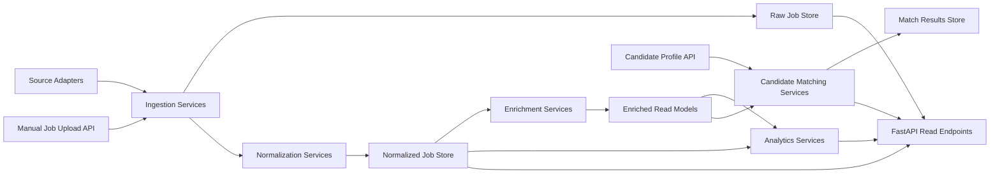
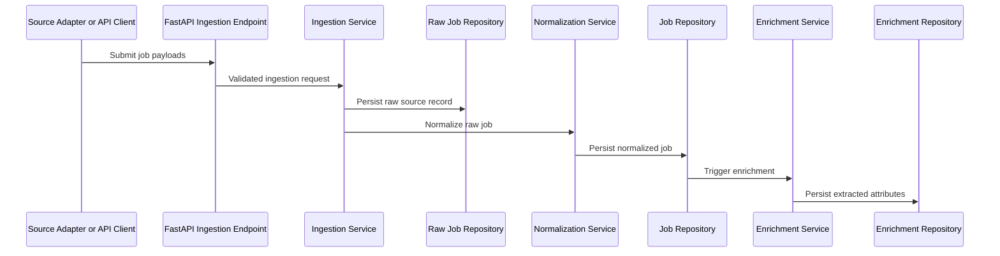
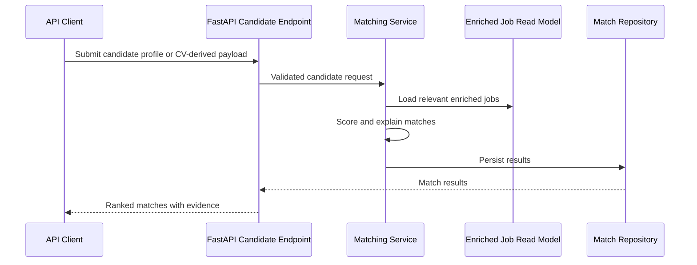

# Architecture

## Document Status

- Status: Active
- Date: July 19, 2026
- Product: Job Market Intelligence Platform

## 1. Architecture Goals

The architecture must support the MVP defined in the PRD while keeping the system simple enough to implement incrementally from the existing notebook foundation.

The design goals are:

- separate exploration from production code
- support one source first, but allow additional adapters later
- keep deterministic enrichment and analytics explainable
- preserve clear service boundaries without over-distributing the system
- make the platform easy to test, run locally, and deploy

## 2. Repository Structure

```text
job-market-intelligence-platform/
├── apps/
│   └── api/
│       └── main.py
├── docs/
│   ├── 00-product-vision.md
│   ├── 02-prd.md
│   ├── 03-architecture.md
│   ├── 04-roadmap.md
│   ├── 05-operational-runbook.md
│   ├── 06-local-development.md
│   ├── 07-api-examples.md
│   ├── 08-deployment-guide.md
│   └── adr/
├── notebooks/
│   └── exploratory-job-market-analysis.ipynb
├── src/
│   └── job_market/
│       ├── domain/
│       │   ├── jobs/
│       │   ├── candidates/
│       │   ├── enrichment/
│       │   └── analytics/
│       ├── application/
│       │   ├── ingestion/
│       │   ├── normalization/
│       │   ├── enrichment/
│       │   ├── matching/
│       │   └── analytics/
│       ├── infrastructure/
│       │   ├── db/
│       │   ├── repositories/
│       │   ├── ingestion/
│       │   ├── ai/
│       │   └── observability/
│       ├── interfaces/
│       │   ├── api/
│       │   └── schemas/
│       ├── config/
│       └── shared/
├── tests/
│   ├── unit/
│   ├── integration/
│   └── api/
├── alembic/
├── scripts/
├── docker/
├── terraform/
├── pyproject.toml
├── README.md
└── .github/
    └── workflows/
```

## 3. Architectural Style

The architecture is a modular monolith with clear internal boundaries.

This means:

- one deployable backend service for the MVP
- distinct domain and application modules
- infrastructure isolated behind interfaces
- no premature microservice split

This trade-off keeps deployment and local operation simple while the domain and load profile evolve. Internal module boundaries preserve a path to extracting services if scaling or organizational needs justify it.

## 4. High-Level System Components



## 5. Logical Layers

### Domain Layer

Contains core business concepts and invariants:

- job posting
- raw source record
- normalized location
- normalized compensation
- role family
- seniority
- skill
- technology
- candidate profile
- job match result

This layer should not depend on FastAPI, SQLAlchemy, or external AI providers.

### Application Layer

Contains use cases and orchestration:

- ingest jobs
- normalize jobs
- enrich jobs
- analyze market data
- evaluate candidate matches

This layer coordinates domain logic and repository interfaces.

### Infrastructure Layer

Contains implementation details:

- database access
- SQLAlchemy models
- Alembic migrations
- source adapters
- AI provider clients
- logging and metrics integration

### Interface Layer

Contains external contracts:

- FastAPI routers
- Pydantic request and response schemas
- dependency wiring
- error translation

## 6. Component Responsibilities

### Ingestion

Responsibilities:

- fetch or accept job payloads
- preserve raw source data
- attach source metadata
- deduplicate records
- hand off accepted records for normalization

Initial implementations:

- source adapter for the current GeekHunter-style flow
- manual upload endpoint for testing and controlled ingestion

### Normalization

Responsibilities:

- normalize title, location, work mode, and compensation
- clean and standardize job description text
- map synonyms into canonical values
- prepare records for deterministic enrichment

### Enrichment

Responsibilities:

- extract skills
- detect frameworks, databases, and cloud providers
- classify role family
- classify seniority
- produce evidence snippets and confidence where justified

### Analytics

Responsibilities:

- aggregate job demand across dimensions
- compute skill frequency
- compute skill co-occurrence
- support filters by location, seniority, role family, source, and work mode

### Candidate Matching

Responsibilities:

- parse candidate input into normalized profile attributes
- compare candidate skills with enriched job requirements
- compute match score
- identify matching and missing skills
- provide evidence-backed explanations

## 7. Data Flow

### 7.1 Job Ingestion Flow



### 7.2 Candidate Matching Flow



## 8. API Boundaries

The backend should remain API-first. Proposed first resource groups:

### System Endpoints

- `GET /health`
- `GET /ready`
- `GET /version`

### Ingestion Endpoints

- `POST /v1/jobs:ingest`
- `POST /v1/jobs:upload`
- `GET /v1/ingestions/{ingestion_id}`

### Job Endpoints

- `GET /v1/jobs`
- `GET /v1/jobs/{job_id}`
- `GET /v1/jobs/{job_id}/enrichment`

### Analytics Endpoints

- `GET /v1/analytics/skills/top`
- `GET /v1/analytics/technologies/top`
- `GET /v1/analytics/locations/demand`
- `GET /v1/analytics/seniority/demand`
- `GET /v1/analytics/work-modes/distribution`
- `GET /v1/analytics/skills/cooccurrence`

### Candidate Endpoints

- `POST /v1/candidates/matches`
- `POST /v1/candidates/profile:analyze`
- `GET /v1/candidate-matches/{match_id}`

### Admin-Oriented Internal Endpoints

- `POST /internal/v1/enrichment/rebuild`
- `POST /internal/v1/analytics/recompute`

These internal endpoints should be gated or excluded from public exposure in production.

## 9. Suggested Request and Response Shape

The public contract should distinguish:

- write models for ingestion and candidate input
- read models for enriched jobs and analytics
- operational models for job runs, health, and status

Principles:

- use Pydantic models for all API boundaries
- expose normalized fields explicitly
- keep raw source data out of default public job responses
- expose evidence and confidence for AI-derived outputs

## 10. Database Design

PostgreSQL is the recommended primary data store for the MVP.

### Core Tables

#### `source_ingestions`

- `id`
- `source_name`
- `source_type`
- `trigger_type`
- `status`
- `started_at`
- `completed_at`
- `error_message`

#### `raw_job_records`

- `id`
- `ingestion_id`
- `source_job_id`
- `source_url`
- `raw_payload`
- `payload_hash`
- `observed_at`

#### `jobs`

- `id`
- `raw_job_record_id`
- `canonical_title`
- `company_name`
- `description_text`
- `work_mode`
- `employment_type`
- `location_text`
- `location_country`
- `location_region`
- `location_city`
- `salary_currency`
- `salary_min`
- `salary_max`
- `posted_at`
- `status`

#### `job_skills`

- `job_id`
- `skill_id`
- `evidence_text`
- `confidence`
- `is_required`

#### `skills`

- `id`
- `canonical_name`
- `category`
- `normalized_slug`

#### `job_technologies`

- `job_id`
- `technology_id`
- `evidence_text`
- `confidence`

#### `technologies`

- `id`
- `canonical_name`
- `technology_type`
- `normalized_slug`

#### `job_classifications`

- `job_id`
- `role_family`
- `seniority`
- `confidence`
- `evidence_text`

#### `candidate_profiles`

- `id`
- `external_ref`
- `summary_text`
- `location_text`
- `years_experience`
- `created_at`

#### `candidate_skills`

- `candidate_profile_id`
- `skill_id`
- `proficiency`
- `evidence_text`

#### `candidate_matches`

- `id`
- `candidate_profile_id`
- `job_id`
- `match_score`
- `confidence`
- `matching_skills_count`
- `missing_skills_count`
- `created_at`

#### `candidate_match_reasons`

- `id`
- `candidate_match_id`
- `reason_type`
- `reason_text`
- `evidence_text`

### Storage Principles

- store raw records separately from normalized records
- avoid coupling API schemas directly to table schemas
- use relational tables for structured enrichment outputs
- reserve JSONB for flexible source payloads and limited metadata

## 11. Read Model Strategy

The MVP should keep writes normalized and reads simple.

Recommended approach:

- normalized tables for source-of-truth entities
- SQL views or application-level projections for analytics reads
- optional materialized views later for heavier aggregate queries

Avoid introducing a separate warehouse or search engine in the first implementation unless actual query requirements force it.

## 12. AI Architecture

### Deterministic First

The first enrichment pipeline should prefer:

- controlled vocabularies
- regex and token-based extraction
- heuristic classifiers
- dictionary-based normalization

### Optional LLM Layer

If LLM features are added later, they should sit behind an interface such as:

- `SummaryProvider`
- `CandidateParsingProvider`
- `ExplanationProvider`

Rules:

- never make LLM usage mandatory for core ingestion
- persist LLM outputs separately from deterministic facts
- track provider, prompt version, and confidence metadata

## 13. Background Processing Strategy

The MVP can start synchronously for low-volume ingestion and matching requests, with a clean seam for asynchronous execution.

Recommended path:

- synchronous API-triggered ingestion for initial development
- service abstractions that can later move to a queue-backed worker
- asynchronous execution added when import volume or latency justifies it

This keeps implementation simpler while preserving a migration path.

## 14. Security And Compliance Considerations

- validate and sanitize all API inputs
- treat uploaded CVs and candidate data as sensitive
- avoid logging raw candidate documents or full raw job payloads at info level
- manage secrets through environment variables or a secret manager in cloud deployment
- enforce least-privilege access for database and cloud resources
- review target source terms of use before enabling scheduled scraping

## 15. Observability Design

The service should emit:

- structured application logs
- request correlation IDs
- ingestion job lifecycle events
- enrichment error metrics
- health and readiness states

Recommended early metrics:

- jobs ingested per run
- normalization failure count
- enrichment failure count
- candidate match latency
- API error rate by route

## 16. Deployment Topology

### Local Development

- FastAPI app container
- PostgreSQL container
- optional worker container later

### Initial AWS Target

- containerized API service
- PostgreSQL on RDS
- secrets in AWS Secrets Manager or SSM Parameter Store
- object storage for raw artifacts if needed
- CloudWatch for logs and metrics

The Terraform configuration implements this topology as the initial AWS deployment target.

## 17. Trade-Off Summary

### Chosen Trade-Offs

- modular monolith over microservices
- PostgreSQL first over multi-store architecture
- deterministic NLP first over LLM-first enrichment
- API-first backend over frontend-first delivery
- source adapter abstraction over hardcoded notebook scraping logic

### Deferred Complexity

- distributed task queues
- vector databases
- event buses
- warehouse-style analytics stack
- full semantic retrieval
- broad multi-source scraping

## 18. Evolution Guidelines

- Keep source ingestion behind adapter and application-service boundaries.
- Define public API schemas independently from persistence models.
- Evolve SQLAlchemy models from the canonical domain rather than notebook columns.
- Keep exploratory notebook code and outputs outside the application runtime.
- Record material architectural changes as ADRs.
