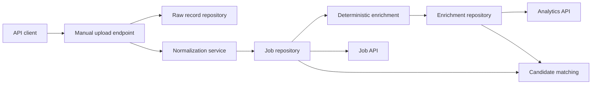

# Architecture

## Status and scope

- Product: Software Engineering Market Intelligence Platform
- Style: modular monolith
- Current release: Version 2 backend foundation
- Deployment status: local runtime supported; no verified public deployment

This document separates the code that exists from the target ingestion lifecycle. Dashed or
explicitly planned elements must not be read as deployed services.

## Product lineage

Version 1 is the preserved GeekHunter-based exploratory notebook under `notebooks/`. Version 2
adds a typed application and infrastructure foundation without rewriting that history. See
[ADR 0005](adr/0005-evolve-to-multi-source-market-intelligence.md).

## Current architecture

Implemented behavior:

- one FastAPI deployable with domain, application, infrastructure, and interface layers
- synchronous manual upload, normalization, persistence, enrichment, analytics, and matching
- in-memory repositories or SQLAlchemy/PostgreSQL repositories
- raw records stored separately from normalized jobs
- a `SourceAdapter` protocol that returns raw records
- a preserved GeekHunter HTML parser with no live retrieval implementation

Not implemented:

- an operational external source connector
- scheduled or batch ingestion
- deduplication, idempotent upsert, or update detection
- retry orchestration, rate limiting, source-health metrics, or stale-job expiration
- public frontend or verified production environment

## Target multi-source ingestion flow

```mermaid
flowchart LR
    Connector[Supported source connector] --> RawRecord[Raw source record]
    RawRecord --> Validate[Source validation and mapping]
    Validate --> Normalize[Canonical normalization]
    Normalize --> Dedupe[Deduplication and update detection]
    Dedupe --> Persist[Raw and normalized persistence]
    Persist --> Enrich[Deterministic enrichment]
    Enrich --> Consumers[API, job discovery, analytics, matching]
```

This is a target architecture. It describes the next connector’s contract and lifecycle; it does
not imply that Greenhouse, Lever, Ashby, remote-job feeds, or company career-page connectors exist.

## Source isolation

A source connector owns:

- retrieving records through a permitted public API, feed, or company-hosted endpoint
- validating source-required fields and recording recoverable validation failures
- mapping source-specific fields into `RawJobRecord` and a canonical `JobPosting`
- preserving opaque source metadata only when it is needed for traceability or reprocessing

Source-specific field names, HTML selectors, authentication, pagination, and rate-limit behavior
belong in the infrastructure adapter. Application services, domain models, repositories, and
public API responses must not depend on a provider’s schema.

The existing `SourceAdapter.fetch()` protocol is a minimal seam, not a complete connector
framework. Extend it only while implementing a validated source, when retrieval, validation, and
mapping semantics are known. Do not add empty adapters for possible providers.

## Normalized domain and provenance

The current model records:

| Requirement | Current representation |
| --- | --- |
| Source name | `RawJobRecord.source_name` and `JobPosting.source_name` |
| Source job identifier | `RawJobRecord.source_job_id` |
| Original URL | `source_url` on raw and normalized records |
| Company | `JobPosting.company_name` |
| Retrieval/observation time | `RawJobRecord.observed_at` |
| Publication time | `JobPosting.posted_at` |
| Raw source content | `RawJobRecord.payload` |
| Raw-to-normalized linkage | `JobPosting.raw_record_id` |

The model does not yet record `last_observed_at`, structured source metadata, or a normalization
version. These should be added together with the first operational connector and its upsert
semantics. Deferring them avoids a speculative schema that cannot yet define which observations
represent the same job. Any addition requires an Alembic migration, domain and repository updates,
tests, documentation, and a backward-compatible default or backfill strategy.

## Idempotency, deduplication, and updates

Current uploads always insert new raw and normalized records. Repeating a request creates a
duplicate.

The target strategy is:

1. Prefer the stable pair `(source_name, source_job_id)` when a source guarantees identifier
   stability.
2. Fall back only to a documented deterministic fingerprint of stable canonical fields when a
   source has no identifier.
3. Store every materially new observation or retain an auditable hash, while upserting the
   canonical job.
4. Update `last_observed_at` on repeat observations.
5. Re-normalize only when the payload hash or normalization version changes.

The database uniqueness rule must be chosen from real source behavior. URL alone is not assumed
stable, and cross-source deduplication is deferred until false-merge risks can be evaluated.

## Failure and retry boundaries

For the planned connector lifecycle:

- retrieval failures: retry outside domain normalization with bounded exponential backoff and
  jitter; honor provider `Retry-After` guidance
- authentication or authorization failures: do not retry indefinitely; disable the run and alert
- source validation failures: quarantine the individual record and continue the bounded run
- normalization failures: retain raw provenance, record the version and error, and permit replay
- persistence failures: roll back the record transaction and retry only transient database errors
- enrichment failures: keep the normalized job and retry enrichment independently

Rate limits are connector-specific configuration. Connectors must use documented endpoints,
identify themselves where required, avoid bypassing access controls, and respect terms, robots
directives where applicable, pagination constraints, and request quotas.

## Observability requirements

Current structured request logs and process-local API metrics do not cover ingestion runs. Before
scheduled ingestion, add:

- run and source identifiers in logs
- retrieved, accepted, rejected, inserted, updated, unchanged, and expired counts
- latency and error metrics by connector and pipeline stage
- last-success time and consecutive-failure source health
- alerts for authorization failures, sustained failure rates, and stale source data

Raw payloads and candidate data must not be emitted into routine logs.

## Stale jobs, deletion, and retention

There is no current expiration workflow. The target policy is source-aware:

- mark a job inactive after a configured number of missed successful observations
- distinguish source absence from connector failure; failed runs must not expire records
- retain minimum provenance required for audit and reprocessing
- define deletion windows for raw payloads and candidate data
- provide deletion workflows for personal data before candidate profiles become persistent product
  accounts

Hard deletion should be reserved for explicit retention or legal requirements. Exact windows
remain a product, legal, and operational decision.

## API and consumer boundaries

Implemented endpoints:

- system: `/health`, `/ready`, `/version`, `/metrics`
- jobs: manual upload, list, and detail
- analytics: top skills, top technologies, and skill co-occurrence
- matching: request-scoped candidate-to-job matches

Generated OpenAPI documentation is available at `/docs` when the API runs. Planned job explorer,
dashboard, additional filters, ingestion administration, user accounts, and AI-assisted insights
are consumers of the normalized model, not implemented services.

## Deployment topology

Docker Compose provides a local API and PostgreSQL stack. Terraform describes an AWS baseline with
ECS Fargate, RDS PostgreSQL, an ALB, Secrets Manager, and CloudWatch logs, but the repository
contains no evidence that it has been applied. HTTPS, remote state, environment separation,
backups, secret rotation, deployment rollback, and production monitoring require completion
before calling the system production-ready.

## Evolution rules

- Keep Version 1 assets intact and outside the production runtime.
- Add one authorized, tested connector before generalizing the adapter contract.
- Keep source schemas out of domain, service, and public API layers.
- Pair every schema change with a migration, tests, documentation, and compatibility notes.
- Prefer a deployed, usable vertical slice over broad internal refactoring.
- Record material decisions as ADRs.
